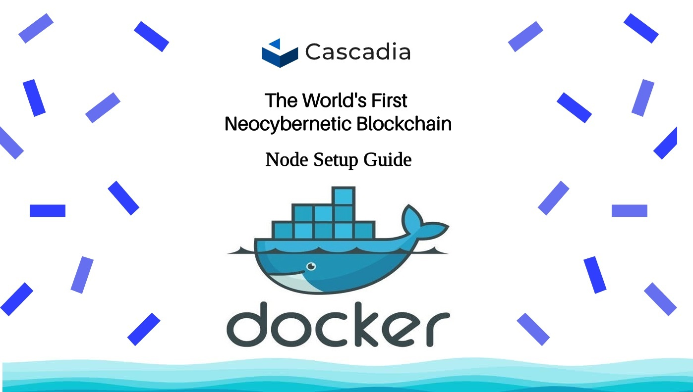

[]()
## Useful links
___
* [**`Cascadia Website`**](https://www.cascadia.foundation)
* [**`Cascadia Twitter`**](https://twitter.com/CascadiaSystems)
* [**`Cascadia Discord`**](https://discord.gg/cascadia)
* [**`Cascadia Github`**](https://github.com/CascadiaFoundation)
* [**`Official doc`**](https://cascadia.gitbook.io/gitbook)
* [**`Faucet`**](https://www.cascadia.foundation/faucet)
* [**` OfficialExplorer`**](https://validator.cascadia.foundation)
___
## Minimum System Requirements
* 2 x dedicated/physical CPUs withSSE4.1 and SSE4.2 flags (use [lscpu](https://manpages.ubuntu.com/manpages/trusty/man1/lscpu.1.html) to verify)
* 8 GB RAM
* 200 GB SSD
* 100 Mbit/s always-on internet connection with 4 TB/month data plan
* Linux OS (Ubuntu 20.04 or the latest version is recommended)
___
## Node Setup Guide

### Installing Docker Engine
* Update the apt package index:
```
sudo apt-get update
```
* Install Docker Engine, containerd, and Docker Compose:
```
sudo apt-get install docker-ce docker-ce-cli containerd.io docker-buildx-plugin docker-compose-plugin
```
* Verify that the Docker Engine installation is successful by running the hello-world image:
```
sudo docker run hello-world
```
### Downloading Dockerfile
```
wget https://raw.githubusercontent.com/Va1Ke/guides/main/Cascadia/Dockerfile
```
### Building  Image
```
docker build --tag 'cascadia' -p 26656:26656 -p 26657:26657 -p 9091:9091 -p 9090:9090 -p 6060:6060 -p 1317:1317
```
### Сontinue Setting Up Under Docker
* All other commands we will be using inside our docker container so <br> we need first use: ```docker exec -it id_container bash```.
#### Setting moniker 
```
docker exec -it id_container bash
cascadiad init [moniker] --chain-id cascadia_6102-1
```
* [moniker] - name of your node 

#### Downloading the genesis file
* Download and replace the Cascadia Testnet ```genesis.json``` by:
```
curl -LO https://github.com/CascadiaFoundation/chain-configuration/raw/master/testnet/genesis.json.gz
gunzip genesis.json.gz
cp genesis.json ~/.cascadiad/config/
```
#### Setting persistent peers
* Persistent peers allow your node to connect to other nodes and join the network.
```
sed -i.bak -e "s/^persistent_peers *=.*/persistent_peers = \"$(curl  https://raw.githubusercontent.com/CascadiaFoundation/chain-configuration/master/testnet/persistent_peers.txt)\"/" ~/.cascadiad/config/config.toml
```
#### Setting minimum gas price
* In ```~/.cascadiad/config/app.toml```, update the min gas price to avoid transaction spam.
```
sed -i.bak -e "s/^minimum-gas-prices *=.*/minimum-gas-prices = \"0.0025aCC\"/" ~/.cascadiad/config/app.toml
```
#### Creating systemd service file
* First use: 
```
export TERM=xterm
```
* and than:
```
sudo nano /etc/systemd/system/cascadiad.service
```
#### Copy/paste the following configuration, save, and exit.

* and than:
```
[Unit]
Description=Cascadia Node
After=network.target
 
[Service]
Type=simple
User=validator
WorkingDirectory=/usr/local/bin
ExecStart=/usr/local/bin/cascadiad start --trace --log_level info --json-rpc.api eth,txpool,personal,net,debug,web3 --api.enable
Restart=on-failure
StartLimitInterval=0
RestartSec=3
LimitNOFILE=65535
LimitMEMLOCK=209715200
 
[Install]
WantedBy=multi-user.target
```
### Start Your Node
```
# reload service files
sudo systemctl daemon-reload
```
```
# create the symlink
sudo systemctl enable cascadiad.service
```
```
# start the node
sudo systemctl start cascadiad.service
```
```
# show logs
journalctl -u cascadiad -f
```

### Some Useful Commands:

```python
# Access help.
cascadiad --help

# Get your valoper address.
cascadiad keys show wallet --bech val -a

# Check your validator balance.
cascadiad query bank balances <your_validator_address>

# Query active validators
cascadiad query staking validators --limit 2000 -o json | jq -r '.validators[] | select(.status=="BOND_STATUS_BONDED") | [.operator_address, .status, (.tokens|tonumber / pow(10; 6)), .description.moniker] | @csv' | column -t -s"," | sort -k3 -n -r

# Delegate tokens to your valoper address
cascadiad tx staking delegate <validator_address> <amount> --from <wallet_name> --chain-id cascadia_6102-1 --gas auto --gas-adjustment=1.2 --gas-prices 7aCC -y
```