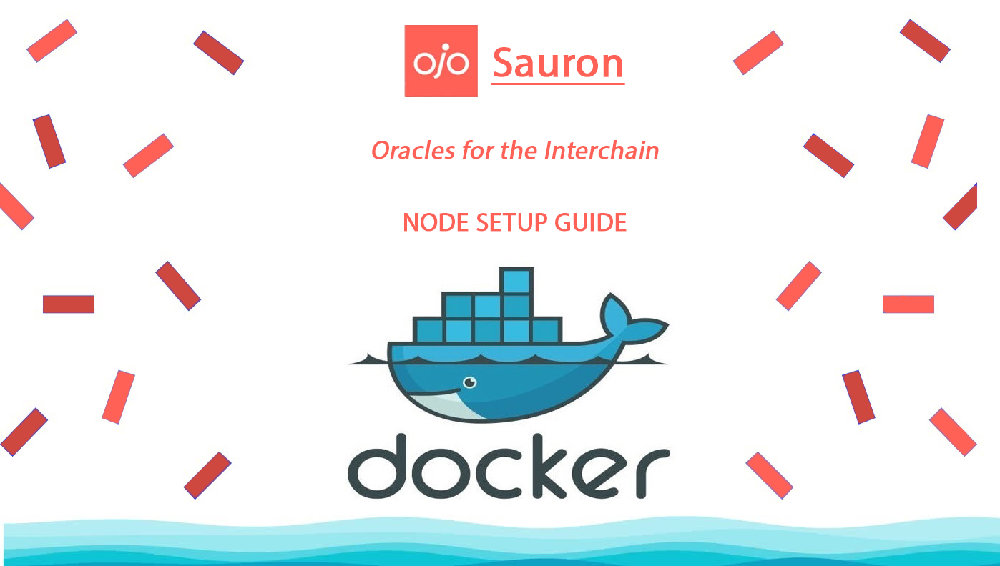

[]()
## Useful links
___
* [**`Ojo Website`**](https://ojo.network/)
* [**`Ojo Twitter`**](https://twitter.com/ojo_network)
* [**`Ojo Discord`**](https://discord.gg/7qGQUnRgZf)
* [**`Ojo Github`**](https://github.com/ojo-network)
* [**`Official doc`**](https://docs.ojo.network/)
___

## Node Setup Guide

### Installing Docker Engine
* Update the apt package index:
```
sudo apt-get update
```
* Install Docker Engine, containerd, and Docker Compose:
```
sudo apt-get install docker-ce docker-ce-cli containerd.io docker-buildx-plugin docker-compose-plugin
```
* Verify that the Docker Engine installation is successful by running the hello-world image:
```
sudo docker run hello-world
```
### Downloading Dockerfile
```
wget https://raw.githubusercontent.com/Va1Ke/guides/main/Ojo/Dockerfile
```
### Building  Image
```
docker build -t "ojo:Dockerfile" .
```
### Сontinue Setting Up Under Docker
* All other commands we will be using inside our docker container so <br> we need first use: ```docker exec -it id_container bash```.
#### Setting moniker 
```
docker run -e MONIKER='YOUR_MONIKER' -p 26658:26658 -p 15058:15058 -p 26657:26657 -p 15057:15057 -p 6060:6060 -p 15060:15060 -p 26656:26656 -p 15056:15056 -p 15066:15066 -p 26660:26660 -p 1317:1317 -p 15017:15017 -p 8080:8080 -p 15080:15080 -p 15090:15090 -p 9091:9091 -p 15091:15091 -it ojo:Dockerfile bash

```
* [moniker] - name of your node

### Some Useful Commands:

```python
#GET SYNC INFO.
ojod status 2>&1 | jq .SyncInfo

# ADD NEW KEY.
ojod keys add wallet

# RECOVER EXISTING KEY.
ojod keys add wallet --recover

# QUERY WALLET BALANCE.
ojod q bank balances $(ojod keys show wallet -a)

# CREATE NEW VALIDATOR.
ojod tx staking create-validator \
--amount 1000000uojo \
--pubkey $(ojod tendermint show-validator) \
--moniker "YOUR_MONIKER_NAME" \
--identity "YOUR_KEYBASE_ID" \
--details "YOUR_DETAILS" \
--website "YOUR_WEBSITE_URL" \
--chain-id ojo-devnet \
--commission-rate 0.05 \
--commission-max-rate 0.20 \
--commission-max-change-rate 0.01 \
--min-self-delegation 1 \
--from wallet \
--gas-adjustment 1.4 \
--gas auto \
--gas-prices 0uojo \
-y


# EDIT EXISTING VALIDATOR.
ojod tx staking edit-validator \
--new-moniker "YOUR_MONIKER_NAME" \
--identity "YOUR_KEYBASE_ID" \
--details "YOUR_DETAILS" \
--website "YOUR_WEBSITE_URL" \
--chain-id ojo-devnet \
--commission-rate 0.05 \
--from wallet \
--gas-adjustment 1.4 \
--gas auto \
--gas-prices 0uojo \
-y

#UNJAIL VALIDATOR.
ojod tx slashing unjail --from wallet --chain-id ojo-devnet --gas-adjustment 1.4 --gas auto --gas-prices 0uojo -y

#VIEW VALIDATOR DETAILS.
ojod q staking validator $(ojod keys show wallet --bech val -a)


```